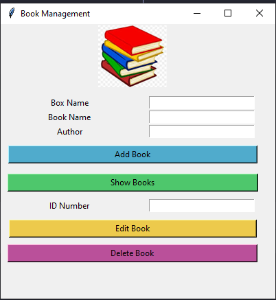

# BookManagement_tkinter

I developed this application for my personel usage. It is a simple book tracking application.

- Language : **Python** 
- Libraries : **Tkinter** (Gui), **Pillow** (Images), **Pandas** (Dataframe)
- DB: **SQLite** 

## Functional Software Requirements
- Add a book
- Show all books like table format
- Save books table as excel file
- Edit book
- Delete book

## Screenshot

 

